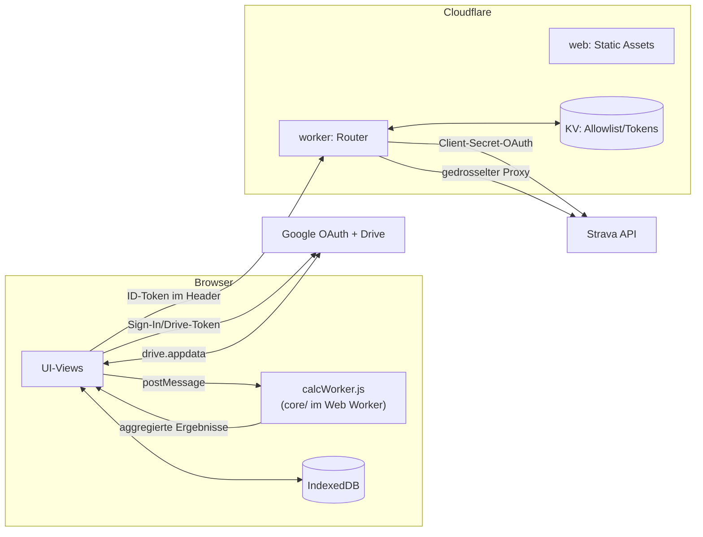

# Architektur (Phase 1 – Analyse)

> **Zeitstempel-Vorbehalt:** Dieses Dokument beschreibt den Stand vom
> 2026-10-01, Vormittag. Während der Analyse lief parallel (außerhalb dieser
> Session) bereits Weiterentwicklung an `core/src/signature.js`,
> `loadResponse.js`, `thresholds.js`, `index.js` und mehreren Web-Views
> ("Signatur-Verfall im Rechenkern" – ein neuer `decaySignature`/
> `currentSignatureAtDate`-Export). Die Modulgrenzen und der Datenfluss unten
> bleiben davon unberührt, aber einzelne Datei:Zeile-Zitate in
> `docs/MODULE.md` (K-05, K-08, K-10) können sich dadurch leicht verschoben
> haben. Siehe `docs/OFFENE-FRAGEN.md`.

## 1. Ist-Architektur

Drei unabhängig deploybare Teile, strikt nach Kap. 5.1 des Lastenhefts
getrennt, ohne Build-Schritt (reine ES-Module überall):

```
performance-app/
  core/    – Rechenkern (reines JS, 0 Laufzeit-Abhängigkeiten, läuft in
             Node/Browser/Web Worker identisch)
  web/     – statisches Frontend (Cloudflare Worker mit Static Assets)
  worker/  – Cloudflare Worker (Auth/OAuth/Proxy, KEINE Trainingsdaten)
  docs/    – LASTENHEFT.md (verbindliche Spec) + diese drei Dateien
```

| Komponente | Hosting | Zuständigkeit | explizit NICHT |
|---|---|---|---|
| `core/` | läuft im Browser (Web Worker) | alle Modellberechnungen | Netzwerk, Speicherung |
| `web/` | Cloudflare Worker (Static Assets) | UI, Orchestrierung, Drive-Zugriff | Secrets |
| `worker/` | Cloudflare Worker | Google-/Strava-OAuth, Proxy, Drosselung, Allowlist | Modellberechnung (10-ms-CPU-Limit), Trainingsdaten |
| Google Drive (`appDataFolder`) | extern, je Nutzer | führende Datenablage | Tokens |
| Cloudflare KV | extern | Allowlist, Rollen, verschlüsselte Strava-Tokens | Streams, Kennzahlen |
| IndexedDB | im Browser | lokaler Cache, jederzeit aus Drive wiederherstellbar | führende Datenhaltung |

`core/` wird vor jedem `web/`-Deploy 1:1 nach `web/vendor/core/src` kopiert
(`web/scripts/sync-core.mjs`) – Cloudflare liefert nur Dateien innerhalb von
`web/` aus. Diese Kopie ist tatsächlich **im Git committet** (24 Dateien,
verifiziert), nicht `.gitignore`t – ein Diskrepanz-Punkt, siehe
`docs/OFFENE-FRAGEN.md`.

### 1.1 Innere Schichtung von `web/`

Keine der vier vom Auftrag genannten Kategorien existiert als eigener
Ordner – alle 34 Dateien liegen flach in `web/src/`. Die Grenzen sind nur
durch Namenskonvention und Import-Disziplin erkennbar, nicht durch die
Verzeichnisstruktur erzwungen:

```
Seiten/Views (P-xx)         – dashboardView, activityListView,
                               activityDetailView, powerCurveView, pmcView,
                               loadResponseView, breakthroughView, weekView,
                               metabolicView, settingsView, profileView,
                               groupView, glossaryView, syncView+onboarding,
                               main.js
Querschnitt (Q-xx)          – auth.js, storage.js/idb.js/streamCodec.js,
                               syncEngine.js/sync.js, api.js/config.js,
                               calcWorker.js/compute.js, theme.js/format.js,
                               sw.js
Datenquellen/Adapter (A-xx) – drive.js (Google Drive, client-seitig),
                               strava.js/tokenManager.js (Strava, worker-seitig)
```

Siehe `docs/MODULE.md` für die vollständige Zuordnung inkl. `core/src`
(K-xx).

## 2. Datenfluss



**Schreibpfad (Sync → Kennzahl):**
1. `syncEngine.js`/`sync.js` holt neue Aktivitäten+Streams über
   `api.js → worker/strava.js` (gedrosselt, Client sieht nie ein
   Strava-Token).
2. `streamCodec.js` kodiert sie ins Monatsbündel-Format.
3. `storage.js` schreibt **Drive-first** (`drive.js`), spiegelt danach in
   `idb.js` (Cache).
4. `compute.js` lädt alle Rohaktivitäten, schickt sie an `calcWorker.js`
   (Web Worker), der **unverändertes** `core/` aufruft
   (`prepareActivity` → `computeSignatureHistory` → `estimateThresholds`/
   `applySportSpecificTss` → `calibrateTau1K1`/`loadResponseSeries`/
   `holdOutBacktest`).
5. `compute.js` schreibt die aggregierten Ergebnisse zurück nach Drive
   (`model/*.json`, `index.json`) – wieder über `storage.js`.
6. Views lesen über `compute.js#loadModelState`/`loadMmpCurves`/
   `loadThresholds`/`loadLoadResponse` und rendern.

**Lesepfad (App-Start):** `storage.js` liest Cache-first (`idb.js`), fällt
bei Cache-Miss auf Drive zurück und füllt den Cache nach – macht
"Drive-Inhalte nach Cache-Löschung wiederherstellbar" (M2-Abnahmekriterium)
automatisch wahr, ohne dass eine View das explizit behandeln muss.

**Kritischer Pfad ohne Zeitlimit:** `compute.js#runInWorker` wartet ohne
Timeout auf die `postMessage`-Antwort von `calcWorker.js` (Q-06-Befund in
`docs/MODULE.md`) – ein nie antwortender Worker blockiert die UI für immer
in einem Ladezustand, im Gegensatz zum sonst konsequent genutzten
`withTimeout`-Muster (`auth.js`, `dashboardView.js`).

## 3. Abhängigkeitsgraph

### 3.1 `core/src` – strikter, zyklenfreier DAG (verifiziert)

```
Blätter (keine core-internen Importe):
  settings.js, types.js, streams.js, quality.js, mmp.js, wbal.js,
  strain.js, cpFit.js, pace.js

mpa.js            → wbal.js
activity.js       → streams.js, quality.js, mmp.js
twoParamCheck.js  → cpFit.js
breakthrough.js   → cpFit.js, mpa.js, mmp.js
metabolic.js      → cpFit.js
signature.js      → cpFit.js, mmp.js, mpa.js, settings.js, breakthrough.js,
                     twoParamCheck.js, strain.js, npTss.js, pace.js
thresholds.js     → pace.js, npTss.js, signature.js (nur lesend: signatureAtDate)
loadResponse.js   → signature.js (nur lesend)
importers/*       → (eigenständig, kein Rückbezug in den Rest von core/)
```

Keine zyklischen Importe, kein modul-globaler mutierbarer Zustand
(`let`/`var` auf Modulebene) irgendwo in `core/src` gefunden – die
NFA-06-Behauptung "reine Funktion, kein I/O" ist **tatsächlich im Code
eingehalten**, nicht nur behauptet. `thresholds.js`, `loadResponse.js` und
`twoParamCheck.js` sind echte, unabhängige Zweitleser des
`computeSignatureHistory`-Ergebnisses und bereits heute isoliert editierbar.

**Die eine echte Ausnahme:** `signature.js#computeSignatureHistory` (130
Zeilen) und `breakthrough.js#refitSignature` (87 Zeilen) sind nicht auf
Funktions-Ebene zerlegt – ein Fix, der nur EINEN der dort verschachtelten
Schritte betrifft (z. B. nur die Evidenz-Schwelle), erfordert trotzdem das
Lesen/Anfassen der ganzen Funktion. Das ist die zentrale Lücke zum
NFA-07-Ziel "Rechenkern in klaren Modulgrenzen", siehe K-04/K-05 in
`docs/MODULE.md`.

### 3.2 `web/src` – Sternförmig um zwei Knotenpunkte

`storage.js` (8 Importeure) und `compute.js` (8 Importeure) sind die
zentralen Knotenpunkte mit dem größten "Blast Radius". `dashboardView.js`
hat mit 13 direkten Importen die höchste Fan-out-Zahl (als Orchestrator
erwartbar). Keine zyklischen Importe gefunden. Auffälligkeit:
`onboarding.js` (laut Namen eine View) wird von 4 anderen Views
(`settingsView.js`, `metabolicView.js`, `profileView.js`, `main.js`) nur
wegen seiner mitexportierten `loadOrInitSettings()`-Funktion importiert –
faktisch ein verstecktes Settings-Repository-Modul, siehe P-14 in
`docs/MODULE.md`.

### 3.3 `worker/src` – saubere dreistufige Schichtung

```
index.js (Router)
  → session.js, tokenManager.js, kvStore.js, cryptoTokens.js,
    strava.js, rateLimiter.js, http.js
tokenManager.js → kvStore.js, cryptoTokens.js, strava.js, http.js
session.js      → googleAuth.js, kvStore.js, http.js
```

Keine zyklischen Importe. `index.js` enthält allerdings mehr
Zustandsübergangs-Logik (Allowlist-Status bei Connect/Disconnect/Invite/
Remove) als ein reiner Dispatch-Table bräuchte – siehe Q-01 in
`docs/MODULE.md`.

## 4. Zielarchitektur

Ziel (laut Auftrag): **jede fachliche Einheit einzeln verbessern können,
ohne den Rest anzufassen.** Der Code ist dafür in weiten Teilen bereits gut
vorbereitet (saubere DAGs, keine Zyklen, viele reine Funktionen mit
Dependency-Injection-Nahtstellen wie `syncEngine.js#createSyncEngine(deps)`
oder `strava.js`s `fetchImpl`-Parameter) – es fehlen gezielt vier Dinge,
keine Neuerfindung der Struktur:

### 4.1 Explizite öffentliche Schnittstelle je Modul

Aktuell exportiert jede Datei "alles, was sie hat". Für die größten
Problemfälle (P-03 `activityDetailView.js`, P-10 `settingsView.js`,
K-05 `signature.js`, K-04 `breakthrough.js`) bedeutet "Modulgrenze mit
expliziter Schnittstelle" konkret: die intern verschachtelten
Unterfunktionen (z. B. `settingsView.js`s sechs `render*Card`-Closures, oder
`signature.js`s Pro-Aktivität-Schleifenkörper) werden zu benannten,
eigenständig importierbaren (und damit testbaren) Funktionen – ohne das
Verhalten zu ändern, nur die Grenze sichtbar zu machen. Das ist eine
Extract-Function-Übung, keine Neuarchitektur, und von der bestehenden
Testsuite sofort gegen Regressionen abgesichert.

### 4.2 Rechenkern strikt von UI/Datenquellen getrennt

Das gilt heute schon fast lückenlos für `core/` selbst (siehe 3.1), aber
**nicht** für den Übergang `web/src` → `core/`: mehrere Views
(`powerCurveView.js`, `activityDetailView.js`, `pmcView.js`) berechnen
"fast reine" Zwischenschritte (`weightAtDate`, `computePmcSeries`) direkt
im Rendering-Code statt sie – wie bereits für `chartUtils.js`/`pmcMath.js`/
`activityFilter.js` erfolgreich gemacht – in eine testbare Utility
auszulagern. Ziel: jede View importiert nur noch (a) fertige
Modellergebnisse aus `compute.js`/`core/` und (b) reine
Darstellungs-Helfer – keine eigene Geschäftslogik mehr.

### 4.3 Eine Schema-Quelle für geteilte Datenformen

`settings.json` (inkl. `profile`), die `PARAM_GROUPS`-Metadaten
(`settingsView.js`), die `ModelSettings`-Form (`core/src/types.js`) und die
Zwischenformate zwischen `syncView.js`/`sync.js`/`syncEngine.js` existieren
heute nur als Objektliterale an mehreren Stellen, nicht als eine
zentrale, von allen Seiten referenzierte Deklaration. Ohne TypeScript (siehe
NFA-07-Entscheidung "JS statt TS", `core/README.md`) ist die pragmatische
Lösung ein zentrales `@typedef` je Datenform an GENAU EINER Stelle, auf die
jede verwendende Datei per JSDoc-Importtyp verweist – kein Build-Schritt
nötig, aber ein fester Nachschlage-Ort statt impliziter Konvention.

### 4.4 Sichtbare statt stille Korrekturen, konsequent

Das Projekt hat dieses Muster bereits etabliert und mehrfach bewusst
eingesetzt (`rawFit`, `pMaxHeld`, `wPrimeHeld`, `wPrimeClampedAtInitial`,
`constraintUnsatisfied`) – es fehlt nur an zwei Stellen, die strukturell
genau gleich gelagert sind: `cpFit.js`s `cp`-Boden (120 W, K-01) und
`strain.js`s `p > pMax`-Fall (K-06). Zielarchitektur heißt hier: **keine
neue Idee, nur die konsequente Anwendung der bereits vorhandenen.**

## 5. Was NICHT Teil der Zielarchitektur sein sollte

- **Kein Bundler/TypeScript/ESLint** einführen, nur um der Form willen – das
  wäre eine Umkehr der expliziten, begründeten M1-Entscheidung
  ("JavaScript statt TypeScript", `core/README.md`) und würde den
  "Zero-Build"-Vorteil (jede Datei sofort ohne Compile-Schritt deploybar)
  aufgeben. Die oben beschriebenen Lücken (Testlücken, fehlende
  Typ-Validierung) lassen sich mit JSDoc + gezielten Tests schließen, ohne
  dieses Fundament zu ändern.
- **Keine Microservice-Zerlegung** von `worker/` – bei 100k Requests/Tag und
  max. 10 Nutzern ist ein einzelner Worker die richtige Größe; die
  empfohlene Extraktion (`membership.js` für Allowlist-Übergänge) bleibt
  innerhalb desselben Deployments.
- **Keine neuen Datenquellen-Adapter** (intervals.icu/TrainingPeaks) ohne
  expliziten neuen Auftrag – das Lastenheft nennt sie nur als
  Funktions-Vorbilder, nicht als Integrationsziel (Kap. 9, Abgrenzung:
  "Datenquellen außer Strava... ausgeschlossen").
