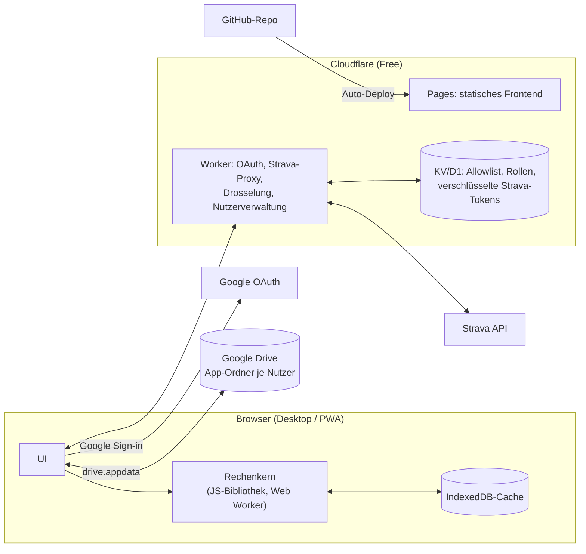

# Lastenheft – Performance-Tracking-Web-App

| | |
|---|---|
| **Arbeitstitel** | Performance App (Trainingsgruppe) |
| **Version** | 1.0 |
| **Stand** | 15.09.2026 |
| **Auftraggeber** | Christian Drößler |
| **Status** | Freigegeben zur Umsetzung (Meilenstein M1) |
| **Ablage** | `docs/LASTENHEFT.md` im GitHub-Repository |

> Dieses Dokument ist das Ergebnis eines strukturierten Anforderungsinterviews (Fragen F1–F16, siehe Kapitel 4). Es ist die verbindliche Grundlage für die Coding Session. Änderungen erfolgen ausschließlich per Commit mit Begründung.

---

## Inhalt

1. Ziel und Zweck
2. Ausgangslage
3. Rahmenbedingungen
4. Entscheidungsprotokoll
5. Systemarchitektur
6. Funktionale Anforderungen
7. Modellspezifikation
8. Nicht-funktionale Anforderungen
9. Abgrenzung (Nicht-Ziele)
10. Meilensteine und Abnahmekriterien
11. Risiken
12. Einstellbare Parameter (Startwerte)
13. Quellen
14. Glossar

---

## 1. Ziel und Zweck

Entwicklung einer kostenlosen Web-Anwendung zur Leistungsüberwachung im Radsport für den Auftraggeber und seine Trainingsgruppe (max. 10 Personen). Die App kombiniert Analysefunktionen, die sich an vier Vorbildern orientieren:

| Vorbild | Übernommener Funktionsbereich |
|---|---|
| **XERT** | Fitness Signature (TP/HIE/PP), MPA, Breakthroughs, belastungsgekoppelter Signaturverlauf |
| **TrainingPeaks** | NP, IF, TSS, Performance Management Chart (CTL/ATL/TSB), Wochen-/Kalenderübersicht |
| **Strava** | Analytische Aktivitätsliste, Detailansicht, persönliche Bestwerte über Dauern |
| **Sentiero Analytics** | Metabolische Zonen, Energie-, Kohlenhydrat- und Fettverbrauch |

**Priorität 1:** Critical-Power-Modellierung und Breakthrough-Funktion.

Datenquelle ist ausschließlich die Strava-API. Die App bildet keine proprietären Algorithmen nach, sondern implementiert veröffentlichte Modelle und kennzeichnet Modellschätzungen als solche.

---

## 2. Ausgangslage

Es existiert eine lokale Anwendung `strava-dashboard` (Windows, `localhost:3000`):

- Backend Node.js/Express (`server.js`), JSON-Dateidatenbank (`db.js`, `data.json`), Streams je Aktivität unter `streams/`
- Strava-OAuth2, Hintergrund-Sync mit Ratelimit-Behandlung, Sync-Zeitraum 30 Tage bis 10 Jahre
- `training-load.js`: FTP = 0,95 × beste 20-min-Leistung, CTL/ATL/TSB als exponentielle Mittelwerte, CP + W′ per linearer Regression, W′bal nach Skiba
- Frontend mit Umschaltung TrainingPeaks-/XERT-Ansicht, Leistungskurve, Strain-Diagramm

**Weiterverwendung:** Die Berechnungslogik aus `training-load.js` dient als Ausgangspunkt für den Rechenkern (M1). Backend, JSON-Datenbank und Server-Architektur werden **nicht** übernommen. Das 2-Parameter-Modell wird durch das 3-Parameter-Modell ersetzt (F5). Die FTP-Schätzung über 20-min-Leistung entfällt zugunsten der TP aus der Signatur (F10).

---

## 3. Rahmenbedingungen

### 3.1 Kosten

- Laufende Kosten: **0 €**.
- Einzige Ausnahme: Das Strava-Abo des Entwicklers (Auftraggeber). Es ist Voraussetzung für API-Zugang im Standard Tier und bereits vorhanden.

### 3.2 Strava-API (Stand September 2026)

| Punkt | Inhalt | Konsequenz |
|---|---|---|
| Tier | Standard Tier, Self-Upgrade auf bis zu **10 Athleten** | Gruppengröße max. 10 inkl. Admin |
| Abo | Strava-Abo für Standard-Tier-Entwickler erforderlich | erfüllt |
| Datenanzeige | Daten eines Nutzers dürfen nur diesem Nutzer angezeigt werden; Daten anderer Nutzer nicht, auch wenn öffentlich | keine Datenfreigabe zwischen Mitgliedern (F1) |
| Weitergabe | keine Weitergabe an andere Nutzer oder Dritte ohne ausdrückliche Einwilligung | Einwilligung zur Drive-Ablage im Onboarding (Kap. 11, R3) |
| Wettbewerb | keine Apps, die Strava-Funktionen nachbauen oder mit Strava konkurrieren | keine Feeds, Karten, Segmente |
| Club-Endpunkte | Club Activities/Admins/Members seit 01.09.2026 abgekündigt | Gruppe wird app-intern verwaltet |
| Ab 01.06.2027 | neue Basis-URL `https://www.api-v3.strava.com`, Tokens nur im Header, `oauth/deauthorize` entfällt zugunsten `oauth/revoke` | von Anfang an so implementieren, Basis-URL konfigurierbar |
| Ratelimit | gilt für die gesamte App (alle Nutzer zusammen) | zentrale Drosselung im Worker, mehrtägiger Erstimport |
| Leistungsdaten | Feld `device_watts` unterscheidet gemessene von geschätzter Leistung | nur `device_watts = true` in Leistungsmodellen |

### 3.3 Google

- **Login:** Sign in with Google mit den Scopes `openid`, `email`, `profile`. Für diese Basis-Scopes gilt keine Testnutzerliste, keine Warnung und kein 7-Tage-Ablauf.
- **Speicher:** Scope `drive.appdata`, ein versteckter App-Ordner im Drive des jeweiligen Nutzers. Der Scope ist als nicht sensibel eingestuft.
- **Veröffentlichungsstatus:** Das OAuth-Projekt muss auf **„In Produktion"** stehen. Im Status „Testing" laufen Autorisierungen nach 7 Tagen ab.
- **Verifizierung:** Bei ausschließlich nicht sensiblen Scopes nicht Pflicht. Die Brand-Verifizierung ist nur nötig, wenn Name und Logo auf dem Consent-Screen erscheinen sollen.

### 3.4 Hosting (Cloudflare Free, Stand August 2026)

| Ressource | Limit | Konsequenz |
|---|---|---|
| Pages (statisch) | Anfragen unbegrenzt, 500 Builds/Monat | Frontend-Hosting |
| Workers | 100.000 Anfragen/Tag, **10 ms CPU** pro Aufruf, 50 Subrequests pro Aufruf | Worker nur für OAuth, Proxy, Drosselung, Nutzerverwaltung; **keine Modellberechnung im Worker** |
| Workers KV | 1 GB, 100.000 Lesezugriffe/Tag, **1.000 Schreibzugriffe/Tag** | Token-Refresh und Allowlist passen, keine Bulk-Daten |
| D1 | 5 GB, 100.000 geschriebene Zeilen/Tag | Alternative zu KV, falls nötig |

Free-Tier-Bedingungen ändern sich regelmäßig. Siehe NFA-08 (Austauschbarkeit) und Risiko R4.

### 3.5 Lizenzen

- **MetaboliSim** (Mader-Modell, Python) steht unter AGPL-3.0. Die App übernimmt **keinen Code** daraus. Die Implementierung erfolgt eigenständig aus den veröffentlichten Gleichungen. MetaboliSim dient nur als Referenz für Testwerte.
- Hinweis: Das ist eine technische Einschätzung, keine Rechtsberatung.

---

## 4. Entscheidungsprotokoll

| Nr. | Frage | Entscheidung |
|---|---|---|
| F1 | Datensichtbarkeit in der Gruppe | Jeder sieht nur eigene Daten |
| F2 | Betriebsort | Webanwendung, kostenlos |
| F3 | Architektur | Browser-App + Google Drive (App-Ordner) pro Nutzer, Cloudflare Pages + Worker |
| F4 | Funktionsumfang V1 | XERT-, TrainingPeaks-, Strava-(analytisch) und Sentiero-Block. Sentiero ohne Ernährungsplanung, Laktatwerte optional |
| F5 | Modellgrundlage | 3-Parameter-Modell nach Morton; MPA aus W′bal; Erholung nach Skiba; Medaillenlogik |
| F6 | Signaturverlauf zwischen Breakthroughs | Belastungsgekoppelt (3D-Impulse-Response-Modell) bereits in V1 |
| F7 | Kalibrierung | Individueller Fit per Backtesting, Literaturwerte als Start/Fallback, keine XERT-Referenz |
| F8 | Breakthrough-Erkennung | Automatisch mit Toleranz, nachträglich verwerfbar |
| F9 | Signatur-Anpassung bei Breakthrough | Refit mit Umverteilung (Parameter dürfen sinken), mit Schutzregeln |
| F10 | Schwellenwert | TP aus Signatur für TSS, IF, Zonen und Stoffwechselmodell; keine manuelle Überschreibung |
| F11 | Metabolisches Profil | Aus Signatur abgeleitet (Mader-MLSS = TP) + optionale Laborwerte als Anker |
| F12 | Sportarten | Rad mit Leistung in allen Modellen; übrige Aktivitäten nur im TrainingPeaks-Block (hrTSS/Pace-TSS) |
| F13 | Nutzerverwaltung | Nur Einladung; Admin ohne Zugriff auf Trainingsdaten |
| F14 | Zielgeräte | Desktop voll, Smartphone als PWA-Kurzübersicht |
| F15 | Umsetzungsreihenfolge | Rechenkern zuerst, getestet mit Strava-Datenexport |
| F16 | Format | Markdown im GitHub-Repository |

**Nachträgliche Präzisierungen aus der Konsistenzprüfung:**

- **Zu F3:** Streams werden gebündelt pro Monat abgelegt, nicht pro Aktivität.
- **Zu F3:** Alle Strava-API-Aufrufe laufen über den Worker. Nur so ist die zentrale Drosselung umsetzbar, der Browser erhält keine Strava-Tokens.
- **Zu F5/F6:** MPA mit quadriertem Erschöpfungsterm und W′-Erholung nach Skiba 2015 (Differentialmodell), gemäß Kontro et al. 2025.
- **Zu F12:** Lauf- und Schwimmschwellen werden sportartspezifisch aus eigenen Daten geschätzt, da sie nicht aus der Rad-TP ableitbar sind.

---

## 5. Systemarchitektur

### 5.1 Komponenten

| Komponente | Verantwortung | Nicht zuständig für |
|---|---|---|
| **Frontend** (Cloudflare Pages) | UI, Orchestrierung von Sync und Berechnung, Drive-Zugriff | Speicherung von Secrets |
| **Rechenkern** (JS-Bibliothek) | Alle Modellberechnungen, läuft in einem Web Worker des Browsers | Netzwerk, Speicherung |
| **Cloudflare Worker** | Strava-OAuth (Client Secret), Token-Refresh, Proxy aller Strava-Aufrufe, app-weite Drosselung, Allowlist/Rollen, Widerruf | Modellberechnung (10-ms-CPU-Limit), Trainingsdaten |
| **KV/D1** | Allowlist, Rollen, Verbindungsstatus, verschlüsselte Strava-Refresh-Tokens, Import-Warteschlange | Streams, Kennzahlen |
| **Google Drive App-Ordner** (je Nutzer) | Führende Ablage aller Trainingsdaten, Kennzahlen, Modellzustände und Einstellungen des Nutzers | Tokens |
| **IndexedDB** | Lokaler Cache für Geschwindigkeit, jederzeit aus Drive wiederherstellbar | führende Datenhaltung |

### 5.2 Datenablage im Drive-App-Ordner (je Nutzer)

| Datei | Inhalt |
|---|---|
| `settings.json` | Nutzereinstellungen (Kap. 12), Gewichtsverlauf, optionale Laborwerte, Einwilligungsstatus |
| `index.json` | Aktivitätsliste mit Metadaten und berechneten Kennzahlen je Aktivität |
| `streams/YYYY-MM.bin` | Komprimierte Sekunden-Streams aller Aktivitäten des Monats (Leistung, HF, Kadenz, Zeit, Geschwindigkeit) |
| `model/signature-history.json` | Signaturverlauf, Breakthroughs (inkl. verworfener), Medaillen |
| `model/calibration.json` | Kalibrierte Modellparameter, Backtesting-Ergebnisse, Modellversion |
| `model/metabolic.json` | Abgeleitetes metabolisches Profil je Zeitpunkt |

- Das Binärformat der Streams und das Kompressionsverfahren werden in M1 festgelegt und versioniert.
- Jede Datei trägt ein Feld `schemaVersion`.

### 5.3 Sync-Ablauf

1. Beim Öffnen der App fragt das Frontend über den Worker neue Aktivitäten ab, beginnend nach der letzten bekannten Aktivität.
2. Der Worker drosselt app-weit anhand der Ratelimit-Angaben in den Strava-Antworten. Die konkreten Header sind in der Strava-Dokumentation zu prüfen.
3. Neue Streams werden geladen, im Browser vorverarbeitet (Kap. 6.4), in das Monatsbündel geschrieben und neu berechnet.
4. Erstimport:
   - unterbrechbar und fortsetzbar
   - verteilt sich automatisch auf mehrere Tage, wenn das Tageskontingent erreicht ist
   - Fortschritt pro Nutzer sichtbar, Neuberechnung chronologisch

---

## 6. Funktionale Anforderungen

Kennzeichnung: **FA-Bereich-Nr.** Die Priorität gilt für V1: **M** = Muss, **S** = Soll.

### 6.1 Anmeldung und Onboarding (AUTH)

| ID | Anforderung | Prio |
|---|---|---|
| FA-AUTH-01 | Anmeldung ausschließlich per Google-Login. Nur Konten auf der Allowlist erhalten Zugang, alle anderen sehen eine neutrale Ablehnungsseite. | M |
| FA-AUTH-02 | Onboarding in fester Reihenfolge: (1) Datenschutzhinweis lesen, (2) ausdrückliche Einwilligung zur Ablage der eigenen Strava-Daten im eigenen Google Drive, (3) Drive-Zugriff (`drive.appdata`) erteilen, (4) Strava verbinden, (5) Gewicht bestätigen oder eingeben. | M |
| FA-AUTH-03 | Ohne Einwilligung aus Schritt 2 wird keine Strava-Verbindung aufgebaut. | M |
| FA-AUTH-04 | Strava-OAuth läuft vollständig über den Worker. Das Client Secret verlässt den Worker nie, Refresh-Tokens werden verschlüsselt gespeichert. | M |
| FA-AUTH-05 | Die angeforderten Strava-Scopes beschränken sich auf das Lesen der Aktivitäten, inklusive privater Aktivitäten des Nutzers. | M |

### 6.2 Nutzerverwaltung (USER)

| ID | Anforderung | Prio |
|---|---|---|
| FA-USER-01 | Rollen: **Admin** (Auftraggeber) und **Mitglied**. | M |
| FA-USER-02 | Der Admin lädt per E-Mail-Adresse des Google-Kontos ein (Eintrag in die Allowlist). Keine Selbstregistrierung, keine Beitrittsanfragen. | M |
| FA-USER-03 | Obergrenze 10 Personen inklusive Admin. Einladungen darüber hinaus werden abgelehnt. | M |
| FA-USER-04 | Admin-Ansicht: Mitgliederliste mit Status (eingeladen / Google verbunden / Strava verbunden), Zeitpunkt des letzten Syncs, Importfortschritt, freie Plätze. **Kein Zugriff auf Trainingsdaten oder Kennzahlen anderer.** | M |
| FA-USER-05 | Entfernen eines Mitglieds: Strava-Zugriff über `oauth/revoke` widerrufen, Tokens löschen, Allowlist-Eintrag entfernen. | M |
| FA-USER-06 | Widerruft ein Mitglied den Zugriff direkt auf Strava, behandelt die App dies wie FA-USER-05, sobald der Widerruf erkannt wird. | M |
| FA-USER-07 | Jedes Mitglied kann über „Meine Daten löschen" den gesamten App-Ordner in seinem Drive löschen und die Strava-Verbindung trennen. | M |
| FA-USER-08 | Einstellungen (Kap. 12) gelten pro Nutzer. | M |

### 6.3 Datenimport und Sync (SYNC)

| ID | Anforderung | Prio |
|---|---|---|
| FA-SYNC-01 | Inkrementeller Sync beim Öffnen der App. | M |
| FA-SYNC-02 | Erstimport mit wählbarem Zeitraum (30 Tage bis gesamte Historie), unterbrechbar, fortsetzbar, mehrtägig bei erschöpftem Kontingent. | M |
| FA-SYNC-03 | Fortschrittsanzeige pro Nutzer, auch nach Schließen und erneutem Öffnen. | M |
| FA-SYNC-04 | App-weite Drosselung im Worker mit fairer Verteilung zwischen den Nutzern. | M |
| FA-SYNC-05 | Der Erstimport ist nur in der Desktop-Ansicht startbar. | M |
| FA-SYNC-06 | Import aus dem Strava-Datenexport (Originaldateien) als Entwicklungs- und Testpfad für den Rechenkern (M1). In der Produktiv-UI nicht erforderlich. | M (M1) |

### 6.4 Datenqualität (DQ)

| ID | Anforderung | Prio |
|---|---|---|
| FA-DQ-01 | Nur Aktivitäten mit `device_watts = true` fließen in Signatur, MPA, Breakthrough, Strain Score, Stoffwechselmodell und NP/TSS aus Leistung ein. | M |
| FA-DQ-02 | Umrechnung auf ein 1-Hz-Raster. Lücken (Pausen, Aufzeichnungsaussetzer) werden **nicht** interpoliert, sondern als Lücke markiert. | M |
| FA-DQ-03 | Ausreißerfilter für physiologisch unplausible Leistungsspitzen. Markierte Punkte sind von der Breakthrough-Erkennung und vom Refit ausgeschlossen. Die Filterregel ist einstellbar. | M |
| FA-DQ-04 | Pausen: Für W′bal läuft die Erholung während Pausen weiter, bei Leistung 0. Die genaue Behandlung langer Lücken wird in M1 festgelegt und getestet. | M |
| FA-DQ-05 | Datenqualitätsprobleme werden pro Aktivität sichtbar gekennzeichnet. | S |

### 6.5 Strava-Block, analytisch (ACT)

| ID | Anforderung | Prio |
|---|---|---|
| FA-ACT-01 | Aktivitätsliste mit Datum, Sportart, Dauer, Distanz, Leistungsdaten ja/nein, TSS, Strain Score, Breakthrough-Status. Filter und Sortierung. | M |
| FA-ACT-02 | Detailansicht: Verläufe von Leistung, Herzfrequenz, Kadenz, dazu MPA und W′bal (Rad mit Leistung), Belastungsanteile, Kennzahlen. | M |
| FA-ACT-03 | Persönliche Bestwerte über Dauern (Leistungskurve) für wählbare Zeiträume, auch in W/kg mit dem Gewicht zum Aktivitätsdatum. | M |
| FA-ACT-04 | Keine Karten, keine Feeds, keine Segmente, keine sozialen Funktionen. | M |

### 6.6 TrainingPeaks-Block (TP)

| ID | Anforderung | Prio |
|---|---|---|
| FA-TP-01 | NP, IF und TSS je Radaktivität mit Leistung. Als Schwelle dient die **TP der Signatur zum Aktivitätsdatum** (F10). | M |
| FA-TP-02 | hrTSS für Aktivitäten ohne Leistung mit Herzfrequenz. Pace-TSS für Laufen. Schwimm-TSS, wenn eine Schwellenpace schätzbar ist, sonst hrTSS. | M |
| FA-TP-03 | Sportartspezifische Schwellen (Schwellen-HF je Sportart, Lauf-Schwellenpace, Schwimm-Schwellenpace) werden automatisch aus eigenen Daten geschätzt, als Schätzung gekennzeichnet und mit Datum versioniert. | M |
| FA-TP-04 | Rad-Schwellen-HF wird aus Radeinheiten mit Leistung nahe der TP geschätzt. | M |
| FA-TP-05 | Aktivitäten ohne schätzbare Schwelle und ohne Herzfrequenz erhalten keinen TSS und werden gekennzeichnet. | M |
| FA-TP-06 | Performance Management Chart (CTL, ATL, TSB) über alle Sportarten. | M |
| FA-TP-07 | Wochen- und Kalenderübersicht mit TSS, Dauer und Anzahl Einheiten je Sportart. | M |
| FA-TP-08 | Jede Kennzahl wird mit den zum Aktivitätsdatum gültigen Schwellen berechnet. Eine Schwellenänderung löst die chronologische Neuberechnung ab diesem Datum aus. | M |

### 6.7 XERT-Block (SIG)

| ID | Anforderung | Prio |
|---|---|---|
| FA-SIG-01 | Fitness Signature je Tag: TP (W), HIE (kJ), PP (W), gemäß Kap. 7.1. | M |
| FA-SIG-02 | Sekündliche MPA und W′bal je Radaktivität mit Leistung, gemäß Kap. 7.2 und 7.3. | M |
| FA-SIG-03 | Startsignatur per Regression über die Maximalbelastungen der ersten 90 Tage der Historie, danach chronologischer Durchlauf. | M |
| FA-SIG-04 | Automatische Breakthrough-Erkennung gemäß Kap. 7.4. | M |
| FA-SIG-05 | Refit mit Umverteilung und Schutzregeln gemäß Kap. 7.5. | M |
| FA-SIG-06 | Medaillen: Bronze (1 Parameter gestiegen), Silber (2), Gold (3). Es zählen nur Anstiege über der Medaillenschwelle, gleichzeitige Absenkungen werden separat angezeigt. | M |
| FA-SIG-07 | Nutzer können einen Breakthrough verwerfen. Danach werden Signatur und alle abhängigen Kennzahlen chronologisch ab diesem Datum neu berechnet. Verworfene Breakthroughs bleiben protokolliert und sind reaktivierbar. | M |
| FA-SIG-08 | Übersichtsliste aller erkannten Breakthroughs nach dem Erstimport, mit Mehrfachauswahl zum Verwerfen. | M |
| FA-SIG-09 | Strain Score je Aktivität, gesamt und aufgeteilt in Low (CP), High (W′), Peak (Pmax), gemäß Kap. 7.6. | M |
| FA-SIG-10 | Belastungsgekoppelter Signaturverlauf zwischen Breakthroughs (3D-Impulse-Response-Modell) gemäß Kap. 7.7. | M |
| FA-SIG-11 | Drei getrennte Belastungscharts (Low/High/Peak) zusätzlich zum PMC. | M |
| FA-SIG-12 | Kalibrierung per Backtesting und Hold-out-Bericht gemäß Kap. 7.8, pro Nutzer einsehbar. | M |
| FA-SIG-13 | Plausibilisierung von PP gegen die gemessene beste 5-s-Leistung, Abweichungen werden angezeigt. | M |
| FA-SIG-14 | Das intern mitgeführte 2-Parameter-Modell (CP, W′, W′bal < 0) dient als Konsistenzprüfung. Widersprüche werden protokolliert, keine eigene Ansicht. | S |

### 6.8 Sentiero-Block, Stoffwechsel (MET)

| ID | Anforderung | Prio |
|---|---|---|
| FA-MET-01 | Metabolisches Profil (VO2max, VLamax) je Zeitpunkt, abgeleitet aus Signatur und Gewicht gemäß Kap. 7.9. | M |
| FA-MET-02 | Optionale Eingabe von Laborwerten (VO2max, VLamax, Laktatwerte mit Leistung) mit Datum als zusätzlicher Anker. Laborwerte überschreiben **nie** die TP. | M |
| FA-MET-03 | Metabolische Zonen, abgeleitet aus dem Stoffwechselmodell, mit MLSS = TP als fester Grenze. Das Zonenschema wird in M5 festgelegt. | M |
| FA-MET-04 | Je Zone: Energieumsatz (kcal/h), Kohlenhydratverbrauch (g/h), Fettverbrauch (g/h). | M |
| FA-MET-05 | Je Radaktivität mit Leistung: Energie gesamt, Kohlenhydrate und Fett gesamt und pro Stunde, Verlauf über die Aktivität. | M |
| FA-MET-06 | Alle Stoffwechselwerte sind in der UI als **Modellschätzung** gekennzeichnet, mit Hinweis auf fehlende experimentelle Validierung. | M |
| FA-MET-07 | Keine Ernährungsplanung, kein Ernährungstagebuch, keine Rezepte. | M |

### 6.9 Einstellungen (SET)

| ID | Anforderung | Prio |
|---|---|---|
| FA-SET-01 | Gewichtsverlauf mit Datum; Startwert aus dem Strava-Athletenprofil. | M |
| FA-SET-02 | Alle Parameter aus Kap. 12 sind pro Nutzer einsehbar. Änderbar sind die als „einstellbar" markierten Parameter. | M |
| FA-SET-03 | Jede Parameteränderung löst die chronologische Neuberechnung aus und wird mit Zeitstempel protokolliert. | M |
| FA-SET-04 | „Auf Kalibrierungswerte zurücksetzen" und „Auf Literaturwerte zurücksetzen". | S |

### 6.10 Mobile Kurzübersicht (PWA)

| ID | Anforderung | Prio |
|---|---|---|
| FA-PWA-01 | Installierbar als Progressive Web App. | M |
| FA-PWA-02 | Inhalte: aktuelle Signatur (TP/HIE/PP) mit Trend, TSB/Form, letzte Aktivität mit Breakthrough-Status und Medaille, neue Medaillen seit letztem Besuch. | M |
| FA-PWA-03 | Inkrementeller Sync der letzten Aktivität ist mobil möglich, der Erstimport nicht. | M |
| FA-PWA-04 | Diagramme werden für die Anzeige ausgedünnt, die Berechnung erfolgt auf voller Auflösung. | M |

---

## 7. Modellspezifikation

Notation: $P$ = Leistung (W) zum Zeitpunkt $t$ (1 Hz), $CP$ ≙ TP, $W'$ ≙ HIE, $P_{max}$ ≙ PP.

> Hinweis zur Übersetzung: In der Signatur gilt TP = CP, HIE = W′ (angezeigt in kJ) und PP = Pmax des 3-Parameter-Modells. XERT definiert PP als höchste 5-s-Leistung im unermüdeten Zustand. Das Modell-Pmax kann laut Validierungsstudien von der gemessenen Momentanleistung abweichen, deshalb FA-SIG-13.

### 7.1 Leistungs-Dauer-Beziehung (3-Parameter-Modell, Morton 1996)

$$t_{lim} = \frac{W'}{P - CP} - \frac{W'}{P_{max} - CP}$$

Für die lineare MPA-Variante ergibt sich die konstant haltbare Leistung über die Dauer $t$:

$$P(t) = CP + \frac{(P_{max} - CP)\,W'}{W' + (P_{max} - CP)\,t}$$

Für die quadrierte MPA-Variante (7.2) wird die Leistungs-Dauer-Kurve numerisch aus der MPA-Bedingung $P = MPA$ bestimmt.

### 7.2 MPA (Maximum Power Available)

$$MPA(t) = P_{max} - (P_{max} - CP)\cdot\left(\frac{W'_{exp}(t)}{W'}\right)^{n}, \qquad W'_{exp} = W' - W'_{bal}$$

- **Standard:** $n = 2$. Das ist die modifizierte Variante nach Kontro et al. 2024, wie in Kontro et al. 2025 verwendet.
- **Einstellbar:** $n = 1$, das ursprüngliche Morton-Modell.
- Für $P > CP$ tritt Erschöpfung ein, wenn $P = MPA$ gilt, nicht erst bei vollständig aufgebrauchtem W′.

### 7.3 W′bal (Skiba et al. 2015, Differentialmodell)

- Für $P > CP$: $\;\dfrac{dW'_{bal}}{dt} = -(P - CP)$
- Für $P \le CP$: $\;\dfrac{dW'_{bal}}{dt} = (W' - W'_{bal})\cdot\dfrac{CP - P}{W'}$

Die Implementierung ist in M1 gegen die Originalpublikation zu verifizieren. Die W′-Erholung wird im Backtesting geprüft, eine individuelle Kalibrierung der Erholung ist in V1 nicht vorgesehen.

### 7.4 Breakthrough-Erkennung

Ein Breakthrough liegt vor, wenn gilt:

$$P(t) > MPA(t)\cdot(1 + \varepsilon) \quad \text{für mindestens } d \text{ zusammenhängende Sekunden}$$

- Startwerte: $\varepsilon = 2\,\%$, $d = 3\,s$. Beide einstellbar und im Backtesting zu überprüfen.
- Nur gültige Datenpunkte zählen (FA-DQ-01 bis 03).
- Mehrere Überschreitungen in einer Aktivität lösen **einen** Refit auf Basis aller Überschreitungen dieser Aktivität aus.

### 7.5 Refit mit Umverteilung

Bei einem Breakthrough werden TP, HIE und PP gemeinsam neu geschätzt.

- **Datenbasis:** Punkte nahe der MPA (Abstand ≤ einstellbarer Schwelle) aus der Breakthrough-Aktivität plus Maximalbelastungen der letzten **90 Tage**.
- **Verfahren:** Robuste Regression, bei der Ausreißer heruntergewichtet werden. Das konkrete Verfahren wird in M1 festgelegt und begründet.
- **Absenkbremse:** Ein Parameter sinkt pro Breakthrough um höchstens **5 %**, und nur, wenn mindestens **2 getrennte Aktivitäten** im Fenster das stützen.
- **Nebenbedingung:** Nach dem Refit liegt die MPA in der Breakthrough-Aktivität überall mindestens auf Höhe der gemessenen Leistung, innerhalb der Toleranz.
- **Zustandskorrektur:** Der Breakthrough setzt den Zustand des 3D-Modells (7.7) auf die neue Signatur.
- **Medaillenschwelle:** Ein Anstieg zählt ab **1 %**.

### 7.6 Strain Score (Kontro et al. 2025)

Energiesystemanteile der Leistung:

- $P_{CP} = \min(P, CP)$
- für $P > CP$: $\;P_{P_{max}} = \dfrac{(P - CP)^2}{P_{max} - CP}$, $\;P_{W'} = P - CP - P_{P_{max}}$
- für $P \le CP$: $\;P_{P_{max}} = P_{W'} = 0$

Strain-Koeffizient, Strain-Rate und Score:

$$k_{strain} = \frac{P_{max} - MPA + CP}{P_{max} - P + CP}, \qquad SR = k_{strain}\cdot P$$

$$SS = \sum_t SR\cdot\frac{P_{max}}{CP^2}\cdot\frac{100}{3600\,s}$$

Teil-Scores $SS_{CP}$, $SS_{W'}$, $SS_{P_{max}}$ ergeben sich analog mit $SR_x = k_{strain}\cdot P_x$.

**Testvektoren** (CP = 300 W, Pmax = 1200 W; Werte aus Kontro et al. 2025):

| P (W) | MPA (W) | Erwartung |
|---|---|---|
| 1000 | – | $P_{P_{max}}$ ≈ 544 W, $P_{W'}$ ≈ 156 W, $P_{CP}$ = 300 W |
| 400 | – | $P_{P_{max}}$ ≈ 11 W, $P_{W'}$ ≈ 89 W, $P_{CP}$ = 300 W |
| 400 | 1200 | $k_{strain}$ ≈ 0,27 |
| 300 | 400 | $k_{strain}$ ≈ 0,92 |
| 300 | 1200 | SS ≈ 100 pro Stunde |
| 800 | 800 | $k_{strain}$ = 1,00 |

### 7.7 Belastungsgekoppelter Signaturverlauf (3D-Impulse-Response)

Für jedes System $s \in \{CP, W', P_{max}\}$ läuft ein eigenes Impulse-Response-Modell mit täglicher Belastung $w_s(t) = \sum SS_s$ des Tages:

$$g_s(t) = g_s(t-1)\,e^{-1/\tau_{1,s}} + w_s(t)\left(1 - e^{-1/\tau_{1,s}}\right)$$
$$h_s(t) = h_s(t-1)\,e^{-1/\tau_{2,s}} + w_s(t)\left(1 - e^{-1/\tau_{2,s}}\right)$$
$$p_s(t) = k_{1,s}\,g_s(t) - k_{2,s}\,h_s(t)$$

- **Umrechnung:** $p_s$ wird über einen je System kalibrierten Umrechnungsfaktor in Änderungen von TP (W), HIE (kJ) und PP (W) relativ zur letzten Breakthrough-Signatur übersetzt.
- **Anzeige-Signatur:** Modellvorhersage abzüglich eines einstellbaren Abschlags. Der Abschlag sorgt dafür, dass Breakthroughs weiterhin erkennbar bleiben. Sein Startwert wird im Backtesting bestimmt.
- **Breakthroughs:** setzen den Zustand gemäß 7.5 neu.
- **Einordnung:** Das Modell ist laut Autoren theoretisch begründet, aber experimentell nicht validiert. Für systemspezifische Parameter existieren keine veröffentlichten Daten.

### 7.8 Kalibrierung und Backtesting

- **Frei geschätzt je Nutzer:** $\tau_{1,s}$ und $k_{1,s}$ je System (6 Parameter), jeweils mit festen Grenzen.
- **Fest:** $\tau_{2,s}$ und $k_{2,s}$ auf Literaturwerten.
- **Startwerte und Fallback:** $\tau_1$ = 42 d, $\tau_2$ = 7 d, wie in gängigen Plattformen. Literaturbereiche: $\tau_1$ ≈ 35–51 d, $\tau_2$ ≈ 8–13 d.
- **Zielfunktion:** Abweichung zwischen vorhergesagter Signatur und der durch spätere Breakthroughs bestätigten Signatur.
- **Fallback-Regel:** Unterhalb einer Mindestanzahl an Breakthroughs (einstellbar) werden Literaturwerte genutzt, das wird angezeigt.
- **Hold-out-Test (Abnahme):**
  - Kalibrierung auf der Historie bis zu einem Stichtag.
  - Vorhersage der Breakthrough-Signaturen danach, Startwert: letzte 6 Monate.
  - Bericht der mittleren absoluten Abweichung je Parameter (TP in W, HIE in kJ, PP in W).

### 7.9 Stoffwechselmodell (Mader)

- **Grundlage:** Eigene JavaScript-Implementierung des Mader-Modells aus den veröffentlichten Gleichungen (Mader 2003; Heck et al. 2022; Gleichungsanhang und Standardparameter in Dunst et al. 2026).
- **Eingaben:** Körpermasse (Gewicht zum Datum), aktive Muskelmasse (Standard 30 % für Radfahren), VO2max, VLamax.
- **Ableitung von VO2max und VLamax** (F11), zwei Bedingungen:
  1. Modell-MLSS = TP der Signatur zum Datum.
  2. Kurzzeitbedingung: Das Modell trifft die Kurzzeitleistungsfähigkeit aus dem 3-Parameter-Modell. Welche Dauer bzw. Metrik als Bedingung dient, wird in M5 festgelegt und begründet.
- **Laborwerte** (FA-MET-02) gehen als gewichtete Zusatzbedingung ein. Bedingung 1 bleibt immer erfüllt.
- **Substratverbrauch:** Die Fettoxidation ergibt sich im Modell aus der Differenz zwischen glykolytischer Pyruvatbildung und tatsächlicher Pyruvatoxidation.
  - V1: Steady-State-Formulierung als Lookup je Leistungswert, angewendet auf die geglätteten Aktivitätsdaten und als Näherung gekennzeichnet.
  - Die dynamische Simulation ist optional (S) für eine spätere Version.
- **Energieäquivalente:** werden im Code dokumentiert und mit Quelle belegt.
- **Testreferenz dynamisches Modell** (Heck et al. 2022, reproduziert in Dunst et al. 2026): 50 W, 600 s, 75 kg, 30 % aktive Muskelmasse, VO2max 50 ml/min/kg, VLamax 0,5 mmol/l/s ergibt PCr ≈ 16,46 mmol/kg Muskel und Blutlaktat ≈ 1,09 mmol/l.

---

## 8. Nicht-funktionale Anforderungen

| ID | Anforderung |
|---|---|
| NFA-01 **Kosten** | Betrieb vollständig innerhalb kostenloser Kontingente (Cloudflare Free, Google, GitHub). Keine Dienste, die eine hinterlegte Zahlungsmethode mit möglicher Abrechnung erfordern. |
| NFA-02 **Datenschutz** | Datenschutzhinweis für Mitglieder: welche Daten, wo gespeichert, wer Zugriff hat (Admin nicht), Löschweg. Trainingsdaten liegen ausschließlich im Drive des jeweiligen Nutzers und im lokalen Browser-Cache. Der Worker speichert keine Trainingsdaten. |
| NFA-03 **Sicherheit** | Secrets nur als Worker-Umgebungsvariablen. Refresh-Tokens verschlüsselt. OAuth mit `state`-Parameter. Allowlist-Prüfung bei jeder Worker-Anfrage. Drosselung der Worker-Endpunkte gegen Missbrauch. Keine Tokens oder personenbezogenen Daten in Logs. Minimale Scopes. |
| NFA-04 **Performance** | Berechnungen in einem Web Worker, die UI blockiert nicht. Diagramme werden für die Anzeige ausgedünnt. Startziel: Neuberechnung einer 6-h-Aktivität ≤ 2 s auf einem aktuellen Desktop-Rechner, Messung in M1. |
| NFA-05 **Nachvollziehbarkeit** | Jede Kennzahl ist reproduzierbar: Modellversion, Parameterstand und Eingangsdaten werden mitgeführt. Formeln und Quellen sind im Code dokumentiert. Parameteränderungen werden protokolliert. |
| NFA-06 **Testbarkeit** | Der Rechenkern ist ohne Netzwerk und ohne Speicher testbar. Testvektoren aus Kap. 7 sind automatisierte Tests. **Echte Trainingsdaten werden nicht ins Repository committet.** |
| NFA-07 **Wartbarkeit** | Klare Modulgrenzen: Rechenkern, Speicherschicht, Strava-Anbindung, UI. Die Wahl zwischen JavaScript und TypeScript sowie die Build-Werkzeuge werden in M1 festgelegt. |
| NFA-08 **Austauschbarkeit** | Speicherschicht und Hosting hinter Schnittstellen. Ein Wechsel von Drive oder Cloudflare darf keinen Umbau des Rechenkerns oder der UI erfordern. |
| NFA-09 **Zukunftssicherheit** | Strava-Änderungen zum 01.06.2027 (Basis-URL, Header-Tokens, `oauth/revoke`) sind ab V1 umgesetzt. Die Basis-URL ist konfigurierbar. |
| NFA-10 **Sprache/Format** | UI auf Deutsch. Metrische Einheiten. Datumsformat TT.MM.JJJJ. Dezimalkomma in der Anzeige. |
| NFA-11 **Kennzeichnung** | Modellschätzungen (Signatur-Vorhersage, Stoffwechselwerte, geschätzte Schwellen) sind in der UI eindeutig als solche erkennbar. |
| NFA-12 **Verfügbarkeit** | Best Effort, keine zugesicherte Verfügbarkeit. |
| NFA-13 **Browser** | Aktuelle Versionen von Chrome, Edge, Firefox und Safari; PWA auf aktuellem Android und iOS. |

---

## 9. Abgrenzung (Nicht-Ziele V1)

- Ernährungsplanung, Ernährungstagebuch, Rezepte
- Karten, Aktivitäts-Feeds, Segmente, soziale Funktionen, Kudos
- Datenfreigabe oder Vergleiche zwischen Gruppenmitgliedern
- Manuelle FTP/TP-Überschreibung
- Leistungsmodelle für Laufen (z. B. Laufleistungsmesser) und Schwimmen
- Individuelle Kalibrierung der W′-Erholung
- Dynamische Stoffwechselsimulation je Aktivität (nur optional, S)
- Trainingsplanung, Workout-Designer, Trainingsempfehlungen
- Native Apps, App-Store-Veröffentlichung
- Datenquellen außer Strava (Garmin, TrainingPeaks, Wahoo usw.)
- Offene Registrierung, Beitrittsanfragen, zweiter Admin

---

## 10. Meilensteine und Abnahmekriterien

### M1 – Rechenkern (Bibliothek)

**Inhalt:**
- Parser für den Strava-Datenexport (Originaldateien der Aktivitäten)
- internes Stream-Format, Datenqualitätsregeln (6.4)
- NP/IF/TSS
- 3-Parameter-Fit, MPA, W′bal, Breakthrough-Erkennung, Refit mit Schutzregeln
- Strain Score und 2-Parameter-Konsistenzprüfung
- einfache lokale Prüfseite zur Sichtkontrolle

**Abnahme:**
- [ ] Alle Testvektoren aus 7.6 bestehen als automatisierte Tests.
- [ ] W′bal-Tests: Konstante Leistung über CP senkt W′bal linear. Die Erholung unter CP nähert sich W′ asymptotisch.
- [ ] Der vollständige Strava-Export des Auftraggebers läuft durch: Signaturverlauf, Breakthrough-Liste und Medaillen entstehen ohne Absturz.
- [ ] Ergebnisse sind deterministisch (zweimal gleiche Eingabe ergibt identische Ausgabe).
- [ ] Die Performance-Messung zu NFA-04 ist dokumentiert.
- [ ] Offene M1-Festlegungen sind begründet dokumentiert: Stream-Format, Ausreisserregel, Lückenbehandlung, Regressionsverfahren, JS oder TS.

### M2 – Fundament

**Inhalt:**
- Cloudflare Pages mit Auto-Deploy aus GitHub, Worker
- Google-Login (Status „In Produktion") mit `drive.appdata`
- Allowlist mit Admin als erstem Eintrag
- Strava-OAuth über den Worker, verschlüsselte Tokens, Proxy mit Drosselung
- Drive-Ablage gemäß 5.2, IndexedDB-Cache
- inkrementeller Sync, mehrtägiger Erstimport

**Abnahme:**
- [ ] Onboarding eines frischen Kontos Ende-zu-Ende gemäß FA-AUTH-02.
- [ ] Im Browser ist kein Strava-Token vorhanden (Prüfung über die Entwicklerwerkzeuge).
- [ ] Der Erstimport setzt nach Schließen des Browsers korrekt fort, ohne Doppelimporte.
- [ ] Ist das Tageskontingent erreicht, pausiert der Import und läuft am Folgetag weiter.
- [ ] Drive-Inhalte sind nach Löschen des Browser-Caches vollständig wiederherstellbar.
- [ ] Die Basis-URL ist konfigurierbar, Tokens werden nur im Header gesendet.

### M3 – Oberfläche TrainingPeaks, Strava und XERT

**Inhalt:** 6.5, 6.6, 6.7 (ohne FA-SIG-10 bis 12) und 6.9.

**Abnahme:**
- [ ] Die Kennzahlen in der UI sind identisch mit den M1-Ergebnissen für dieselben Daten.
- [ ] Das Verwerfen eines Breakthroughs löst die korrekte chronologische Neuberechnung aus, das Reaktivieren stellt den vorherigen Zustand wieder her.
- [ ] hrTSS und Pace-TSS erscheinen für Nicht-Rad-Aktivitäten, fehlende Schwellen sind gekennzeichnet.
- [ ] Die Schwelle zum Aktivitätsdatum wird nachweislich verwendet (Testfall mit Breakthrough mitten im Zeitraum).

### M4 – 3D-Modell und Kalibrierung

**Inhalt:** FA-SIG-09 bis 12, Kap. 7.6 bis 7.8.

**Abnahme:**
- [ ] Drei Belastungscharts plus PMC.
- [ ] Die Kalibrierung liefert Parameter innerhalb der Grenzen.
- [ ] Der Hold-out-Bericht für den Auftraggeber liegt vor (Abweichung je Parameter).
- [ ] Die Fallback-Regel greift nachweislich bei einem Testkonto mit wenigen Daten.
- [ ] Startwert für den Anzeige-Abschlag ist aus dem Backtesting bestimmt und dokumentiert.

### M5 – Stoffwechselmodell

**Inhalt:** 6.8, Kap. 7.9.

**Abnahme:**
- [ ] Der Referenztestfall aus 7.9 wird innerhalb dokumentierter Toleranz reproduziert.
- [ ] Modell-MLSS weicht höchstens ±2 W von der TP ab (Startwert, einstellbar).
- [ ] Kurzzeitbedingung und Zonenschema sind festgelegt und begründet.
- [ ] Laborwerte verändern das Profil, die TP bleibt unverändert.
- [ ] Alle Stoffwechselwerte sind als Modellschätzung gekennzeichnet.

### M6 – Gruppe, Datenschutz, PWA

**Inhalt:** 6.2, 6.10, NFA-02.

**Abnahme:**
- [ ] Einladung, Beitritt und Entfernen mit einem zweiten Testkonto funktionieren.
- [ ] Die Admin-Ansicht enthält nachweislich keine Trainingsdaten, der Worker speichert keine.
- [ ] Ein Widerruf auf Strava wird erkannt und wie Entfernen behandelt.
- [ ] „Meine Daten löschen" leert den App-Ordner vollständig.
- [ ] Die PWA ist auf Android und iOS installierbar, die Kurzübersicht gemäß FA-PWA-02 funktioniert.
- [ ] Der Datenschutzhinweis ist im Onboarding eingebunden.

---

## 11. Risiken

| Nr. | Risiko | Auswirkung | Maßnahme |
|---|---|---|---|
| R1 | Strava ändert API-Bedingungen oder entzieht den Zugang; API-Zugang ist laut Agreement ein Privileg, kein Recht | App ohne Datenquelle | Rechenkern unabhängig von Strava (M1); Import aus Datenexport technisch vorhanden |
| R2 | App-weites Strava-Ratelimit reicht für den Erstimport mehrerer Nutzer nicht | Import dauert Tage | Mehrtägiger Import, faire Verteilung, gestaffeltes Onboarding der Mitglieder |
| R3 | Auslegung „Weitergabe an Dritte" bei Ablage in Google Drive | Verstoß gegen API Agreement | Ausdrückliche Einwilligung im Onboarding; bei Unsicherheit Anfrage an developers@strava.com |
| R4 | Verschlechterung kostenloser Kontingente (Cloudflare, Google) | Kosten oder Funktionsausfall | NFA-08 Austauschbarkeit; Limits jährlich prüfen |
| R5 | 3D-Modell und systemspezifische Parameter sind nicht validiert | Signaturvorhersage ungenau | Hold-out-Bericht, Kennzeichnung als Schätzung, Breakthroughs korrigieren den Zustand |
| R6 | Überanpassung bei der Kalibrierung aus wenigen Breakthroughs | Instabile Vorhersagen | Nur 6 freie Parameter mit Grenzen, Fallback-Regel |
| R7 | VLamax ohne Messvalidierung; Mader-Modell nicht experimentell validiert | Stoffwechselwerte ungenau | Kennzeichnung, Laborwerte als Anker, MLSS an TP gebunden |
| R8 | Refit mit Umverteilung reagiert auf verrauschte Daten | Falsche Absenkungen | Absenkbremse, Mindestanzahl stützender Aktivitäten, Verwerfen-Funktion |
| R9 | Google ändert Einstufung von `drive.appdata` oder Verifizierungsregeln | Verifizierungspflicht oder Warnseiten | Regelmäßige Prüfung; Speicherschicht austauschbar |
| R10 | Versehentliche Übernahme von AGPL-Code | Offenlegungspflicht | MetaboliSim nur als Testreferenz; Code-Review-Hinweis |

---

## 12. Einstellbare Parameter (Startwerte)

| Parameter | Startwert | Einstellbar | Festlegung / Quelle |
|---|---|---|---|
| Breakthrough-Toleranz ε | 2 % | ja | F8; Backtesting |
| Breakthrough-Mindestdauer d | 3 s | ja | F8; Backtesting |
| MPA-Exponent n | 2 | ja (1/2) | Kontro et al. 2024/2025 |
| Refit-Fenster | 90 Tage | ja | F9 |
| Absenkbremse je Breakthrough | 5 % | ja | F9 |
| Mindestanzahl stützender Aktivitäten für Absenkung | 2 | ja | F9 |
| Medaillenschwelle | 1 % | ja | F9 |
| Nähe zur MPA für Refit-Punkte | in M1 festzulegen | ja | M1 |
| Fenster Startsignatur | 90 Tage | ja | F9 |
| Ausreißerregel Leistung | in M1 festzulegen | ja | M1 |
| τ₁ (Fitness), Start/Fallback | 42 Tage | über Kalibrierung | Literatur / gängige Praxis |
| τ₂ (Ermüdung), fest | 7 Tage | ja | Literatur / gängige Praxis |
| k₁, k₂, Umrechnungsfaktoren | in M4 festzulegen | über Kalibrierung | M4 |
| Anzeige-Abschlag Signatur | in M4 festzulegen | ja | M4, Backtesting |
| Mindestanzahl Breakthroughs für individuelle Kalibrierung | in M4 festzulegen | ja | M4 |
| Hold-out-Zeitraum | 6 Monate | ja | 7.8 |
| CTL/ATL-Zeitkonstanten (TrainingPeaks-Block) | 42 / 7 Tage | ja | gängige Praxis |
| Aktive Muskelmasse | 30 % | ja | Dunst et al. 2026 (Standard Radfahren) |
| Toleranz Modell-MLSS vs. TP | ±2 W | ja | M5 |

---

## 13. Quellen

**Strava**
- An Update To Our Developer Program (01.06.2026): https://communityhub.strava.com/insider-journal-9/an-update-to-our-developer-program-13428
- API Agreement (2026): https://www.strava.com/legal/api
- API Policy (2026): https://www.strava.com/legal/api_policy

**Google**
- Manage App Audience (Testing, 7-Tage-Ablauf, Basis-Scopes): https://support.google.com/cloud/answer/15549945
- Drive API Scopes: https://developers.google.com/drive/api/guides/about-auth
- OAuth App Verification: https://support.google.com/cloud/answer/9110914

**Hosting (Sekundärquellen; vor M2 gegen offizielle Cloudflare-Dokumentation prüfen)**
- Cloudflare Workers Free Tier: https://agentdeals.dev/vendor/cloudflare-workers
- Cloudflare Pages Free Tier Limits: https://temps.sh/blog/cloudflare-pages-free-tier-limits-2026
- Render Free (verworfene Alternative): https://render.com/docs/free

**Modelle**
- Morton, R. H. (1996). A 3-parameter critical power model. *Ergonomics*, 39(4), 611–619. https://doi.org/10.1080/00140139608964484
- Vinetti, G. et al. (2019). Experimental validation of the 3-parameter critical power model in cycling. *Eur J Appl Physiol*, 119(4), 941–949. https://pubmed.ncbi.nlm.nih.gov/30694386/
- Skiba, P. F. et al. (2015). Intramuscular determinants of the ability to recover work capacity above critical power. *Eur J Appl Physiol*, 115(4), 703–713. https://doi.org/10.1007/s00421-014-3050-3
- Kontro, H., Mastracci, A., Cheung, S. S., MacInnis, M. J. (2025). The three-dimensional impulse-response model. arXiv:2503.14841. https://arxiv.org/abs/2503.14841
- Kontro, H. et al. (2024). Maximum Power Available: An Important Concept for Prediction of Task Failure and Improved Estimation of Training Loads in Cycling. *Journal of Science and Cycling*, 13(2), 7–9.
- Dunst, K., Scharf, V., Hesse, C., Asteroth, A. (2026). MetaboliSim: a Python implementation of the Mader model. arXiv:2606.08366. https://arxiv.org/abs/2606.08366 (Code AGPL-3.0: https://codeberg.org/3phos/metabolisim; nur Referenz)
- Mader, A. (2003). Glycolysis and oxidative phosphorylation as a function of cytosolic phosphorylation state and power output of the muscle cell. *Eur J Appl Physiol*, 88, 317–338.
- Heck, H. et al. (2022). Referenzwerte und Formulierung des Mader-Modells; vollständige bibliografische Angabe siehe Literaturverzeichnis in Dunst et al. 2026.
- VLamax und glykolytische Leistung (Messvalidität): https://doi.org/10.1080/02701367.2025.2481176

**Vorbilder (Funktionsbeschreibung)**
- XERT Fitness Signature: https://www.baronbiosys.com/glossary/fitness-signature/
- XERT MPA: https://www.baronbiosys.com/maximal-power-available/
- XERT Breakthroughs: https://www.baronbiosys.com/breaking-through-the-xert-way/
- XERT Signature Decay: https://www.baronbiosys.com/improvements-to-fitness-signature-decay/
- XERT Beginner's Guide (Definition PP als 5-s-Leistung): https://www.baronbiosys.com/beginners-guide-getting-started-with-xert/
- Sentiero Analytics: https://analytics.sentiero.de/about

---

## 14. Glossar

| Begriff | Bedeutung |
|---|---|
| **TP** | Threshold Power, entspricht CP im 3-Parameter-Modell; einzige Rad-Schwelle der App |
| **HIE** | High Intensity Energy, entspricht W′ (kJ) |
| **PP** | Peak Power, entspricht Pmax im 3-Parameter-Modell |
| **MPA** | Maximum Power Available, momentan maximal abrufbare Leistung |
| **W′bal** | Verbleibende Arbeitskapazität oberhalb CP |
| **Breakthrough** | Leistung überschreitet die MPA; die Signatur war zu niedrig |
| **Strain Score (SS)** | Belastungskennzahl nach Kontro et al., aufteilbar in Low/High/Peak |
| **3D-Impulse-Response** | Drei parallele Fitness-Ermüdungs-Modelle, eines je Energiesystem |
| **NP / IF / TSS** | Normalized Power, Intensity Factor, Training Stress Score |
| **CTL / ATL / TSB** | Chronische Belastung, akute Belastung, Form |
| **hrTSS / Pace-TSS** | TSS aus Herzfrequenz bzw. Pace |
| **MLSS** | Maximales Laktat-Steady-State |
| **VLamax** | Maximale Laktatbildungsrate |
| **PWA** | Progressive Web App, installierbare Web-Anwendung |
| **Allowlist** | Liste der zugelassenen Google-Konten |
